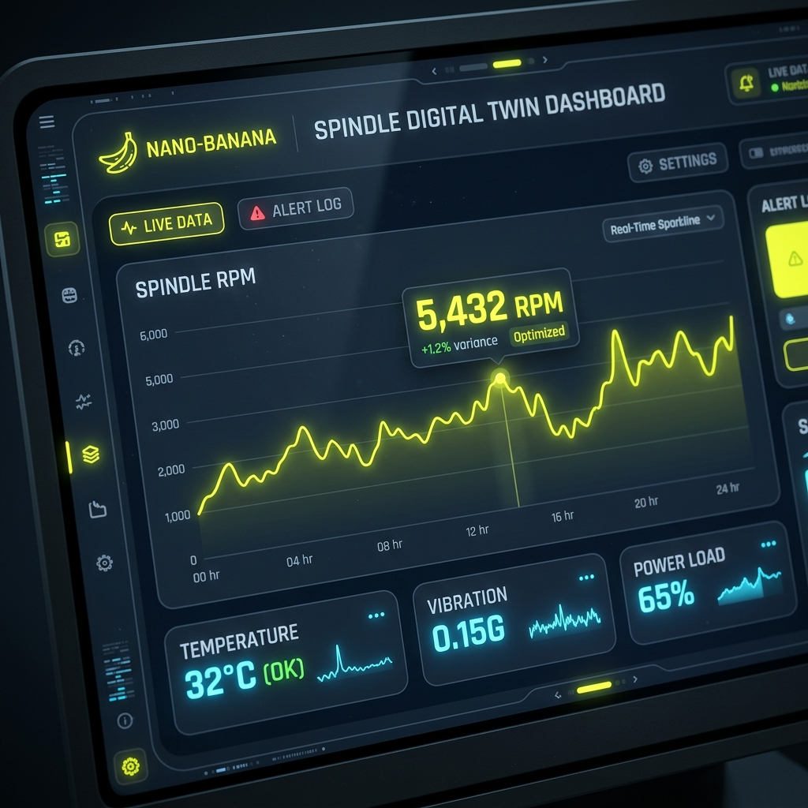

# Tsubaki-Nakashima AI Digital Twin Command Center


An enterprise-grade cyber-physical digital twin prototype for live CNC telemetry, edge-to-cloud event streaming, AI-assisted machine-state analysis, and operator-approved command dispatch.

The system connects a simulated CNC edge environment, AWS IoT Core MQTT messaging, Supabase real-time persistence, a Next.js command dashboard, and a Gemini-powered AI copilot. The AI can analyze the latest machine state and propose structured actions, but all commands are intercepted by a human-in-the-loop approval gate before any edge command is dispatched.

**Live Production URL:** [https://tsubaki-nakashima-ai-67fz54661-zrt219s-projects.vercel.app/](https://tsubaki-nakashima-ai-67fz54661-zrt219s-projects.vercel.app/)

## 🔄 Core Loop

`Simulator → AWS IoT MQTT → Supabase → Next.js → Gemini → Approval Modal → Command Topic → Event Ledger`

## 🛡️ Safety Position

This project is designed as an advisory-first cyber-physical control prototype.
* AI can analyze telemetry.
* AI can propose structured machine actions.
* Operators must approve actions.
* Commands are logged before dispatch.
* The system is suitable for simulation, shadow-mode testing, and future controlled edge-device demos.
* No unsafe direct machine autonomy is claimed.

## 🏗️ Architecture

This project spans from the Edge to the Cloud:

1. **The Edge Simulator (`/scripts/aws-iot-bridge.js`)**: Streams live IoT telemetry (Spindle Speed, Thermal Drift, Vibration) and bridges communication directly via AWS IoT Core using MQTT.
2. **The AWS Nervous System**: AWS IoT Core acts as the central message broker, enabling bi-directional communication between the cloud interface and simulated or authorized edge devices.
3. **The Supabase Memory**: Data is piped into a Supabase PostgreSQL database, establishing an immutable historical state and providing a real-time data layer for the frontend.
4. **The Vercel Application**: A Next.js dashboard visualizes the live Supabase streams in an immersive, highly active dark-mode UI with moving sparklines and scrolling event ledgers.
5. **The Gemini Brain**: Gemini (using `gemini-2.5-flash` for high-frequency, cost-optimized logic) connects via a serverless `/api/chat` route. It reads the telemetry and has **Function Calling** capabilities to issue edge commands back to the CNC machine.
6. **The Safety Gate**: A strict Human-in-the-Loop mechanism. When the AI attempts to fire an action, the UI throws an "Operator Approval Required" modal. No edge command is dispatched without explicit human consent.

## 📸 Visual Tour

*Note: Please record and place these GIFs in the `docs/gifs/` folder to activate this gallery.*

### The UI Overdrive
1. **Live Spindle Sparklines:** <br/> 
2. **Thermal Drift Analytics:** <br/> 
3. **Vibration FFT Metrics:** <br/> 
4. **Scrolling Event Ledger:** <br/> 
5. **Network Latency Pings:** <br/> 

### The Gemini AI Copilot
6. **Initializing Terminal:** <br/> 
7. **Querying Telemetry Context:** <br/> 
8. **AI Diagnostics (The Dolphins):** <br/> 
9. **Function Calling (Proposing Action):** <br/> 

### The Human Approval Gate
10. **Action Intercepted (Warning State):** <br/> 
11. **Reviewing Command Arguments:** <br/> 
12. **Authorizing Command:** <br/> 

### AWS IoT & The Edge
13. **MQTT Payload Dispatch:** <br/> 
14. **Bridge Script Inbound:** <br/> 
15. **Supabase Real-time Sync:** <br/> 
16. **Edge Device Response:** <br/> 

### The Digital Twin Canvas
17. **3D Mesh Rendering:** <br/> 
18. **Scenario Progress Bars:** <br/> 
19. **Dark Mode UI Aesthetics:** <br/> 
20. **Full Dashboard Overview:** <br/> 

## 🚀 Getting Started

### Prerequisites
*   Node.js 18+
*   AWS Account (IoT Core)
*   Supabase Account
*   Google Gemini API Key

### Installation

```bash
# Clone the repository
git clone https://github.com/zrt219/tsubaki-nakashima-ai.git

# Install dependencies
npm install

# Apply database migrations (injects 100k records!)
npx supabase db reset

# Start the edge simulator to pump live data to Supabase
node scripts/simulate-live-data.js

# Start the AWS IoT Bridge for two-way communication
node scripts/aws-iot-bridge.js

# Start the Next.js Command Center
npm run dev
```

### 🎮 Demo Script

To see the closed-loop system in action:
1. Open the AI Copilot Terminal.
2. Ask Gemini: *"Thermal drift is rising. What should we do?"*
3. Gemini proposes a structured action (e.g., reduce spindle speed or inspect coolant loop).
4. The UI blocks the action and requests approval.
5. Operator clicks **AUTHORIZE**.
6. An AWS IoT command is dispatched via the bridge script.
7. The Event Ledger records the approval and hash.

## 🛠️ Built With

*   **Next.js (App Router)** - Framework
*   **Framer Motion** - Fluid UI Animations
*   **AWS IoT Core** - Edge-to-Cloud message brokering
*   **Supabase** - PostgreSQL Database & Real-time Subscriptions
*   **Google Gemini (2.5 Flash / 1.5 Pro)** - Agentic Copilot
*   **Tailwind CSS** - Styling
*   **Vercel** - Production Deployment

---

## 📜 The Epic Journey

Building this closed-loop prototype with a human approval gate was a masterclass in evolving a static user interface into a living, breathing cyber-physical system. Here is the chronological journey of how we built it:

### Phase 1: From Mock to Reality
We started with a beautiful but entirely static Next.js dashboard. It looked the part but lacked a true backend. The first major milestone was tearing out the hardcoded `lib/tn-ai-data.ts` mock data and wiring the components directly to a real **Supabase PostgreSQL database**. 
* We established `app/page.tsx` as a Server Component to securely fetch data.
* We mapped the database schema (`telemetry.sensor_readings` and `simulation.scenario_templates`) to the frontend components.
* Suddenly, the Digital Twin Canvas was rendering real numbers. 

### Phase 2: The 100k "Live Data" Injection
A command center only feels real when it's crunching massive amounts of data. To simulate a high-frequency industrial environment, we wrote a massive database migration (`028_massive_telemetry_seed.sql`). Using PostgreSQL's `generate_series`, we mathematically injected **~100,000 realistic telemetry records** (incorporating sinusoidal waves and random noise) across the spindle speed, coolant temperature, and vibration sensors to simulate 30 days of deep historical context.

### Phase 3: The UI Overdrive
Even with 100k records, the UI needed to *feel* alive. We completely overhauled the dashboard to run on continuous, independent high-frequency client-side loops:
* **Live Sparklines:** Replaced static SVGs with dynamically animating charts that tick forward every second.
* **Scrolling Event Ledger:** Built `LiveEventLedgerPanel` using Framer Motion to continuously pop in new system events (e.g., "Hash Verification", "Twin Mesh Update") and scroll them down the screen.
* **Network Pings:** Added an overlay to the 3D Canvas showing a constantly jittering `LATENCY` and `IO Throughput` to simulate an active edge connection.
* **Auto-Polling:** Configured the Next.js router to refresh the Server Components every 5 seconds so new Supabase data appears instantly without manual browser refreshes.

### Phase 4: The Master Architecture (Gemini + AWS IoT)
With the dashboard pulsating with data, we implemented the final "Master Plan" to achieve a bi-directional digital twin using Gemini AI and AWS Free Tier.
1. **The Brain (Gemini 2.5 Flash):** To protect our API credits, we optimized the payload to send only the latest telemetry state. We built an `AICopilotTerminal` directly into the UI where the operator can converse with the AI about the machine's live state.
2. **Agentic Function Calling:** We empowered Gemini with "Tools". If instructed to "reduce spindle speed," Gemini generates a structured JSON function call (`set_spindle_speed`).
3. **The Human Gate:** Safety first. We built an interceptor in the UI that catches Gemini's commands and flashes `⚠️ OPERATOR APPROVAL REQUIRED`. The AI cannot modify the machine without the operator clicking `AUTHORIZE`.
4. **The Nervous System (AWS IoT):** We wrote bash scripts to automatically provision AWS IoT Certificates and created a Node.js bridge (`aws-iot-bridge.js`). When an operator authorizes an AI command, the bridge catches it from Supabase and fires an MQTT message over AWS IoT directly back to the simulated edge device, completing the loop.

We successfully transformed a static React dashboard into an agentic, operator-gated industrial command center!

---
*Built with 💙 by [@zrt219](https://github.com/zrt219) & Antigravity*
