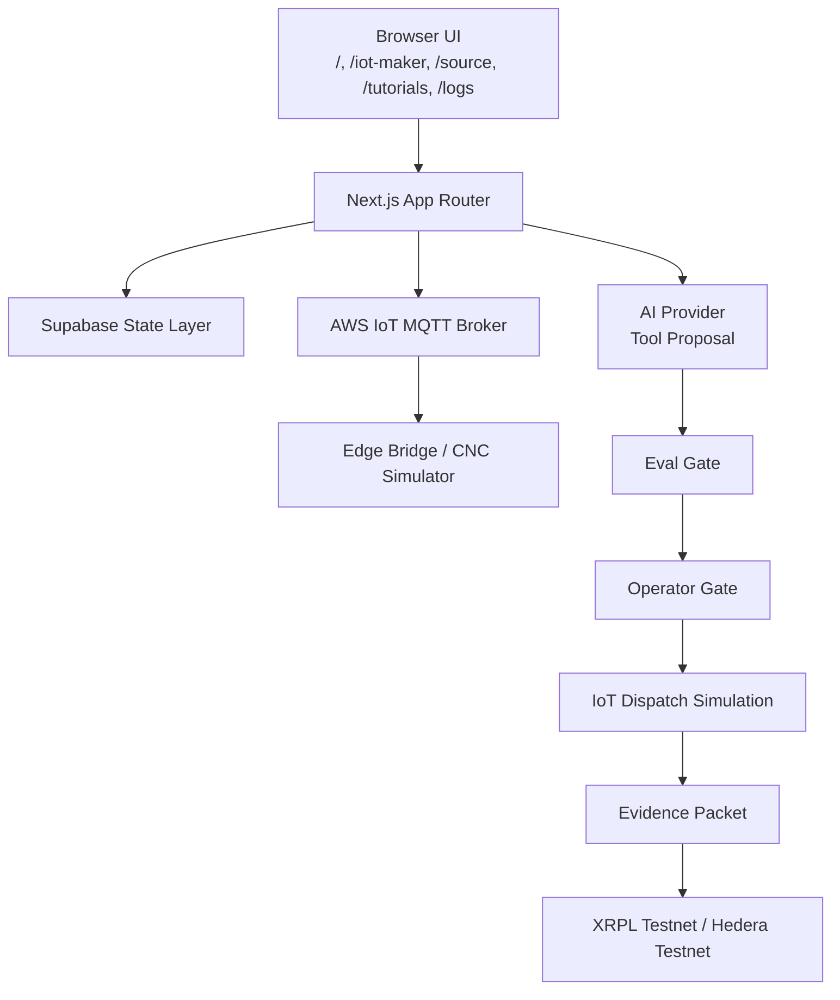

# Tsubaki-Nakashima AI Command Center — ZRT IoT Maker

A recursive agentic cyber-physical AI prototype.

[](https://nextjs.org/docs)
[](https://supabase.com/docs)
[](https://docs.aws.amazon.com/iot/latest/developerguide/what-is-aws-iot.html)
[](https://ai.google.dev/gemini-api/docs/function-calling)
[](https://platform.openai.com/docs/guides/function-calling)
[](https://docs.anthropic.com/en/docs/build-with-claude/tool-use)
[](https://docs.llama.meta.com/docs/tools/)
[](https://xrpl.org/docs/concepts/payment-system/memos-and-uris)
[](https://docs.hedera.com/hedera/sdks-and-apis/networks#testnet)
[](./docs/sources/source-claim-matrix.md)
[](#16-local-development)

## 1. Live Demo

- **Live URL**: https://tsubaki-nakashima-ai-zrt.vercel.app/
- **Core routes**: [`/iot-maker`](/iot-maker), [`/source`](/source), [`/tutorials`](/tutorials), [`/logs`](/logs)
- **GitHub URL**: local repository workspace path (public URL not provided in this package)
- **Run 5-Second Demo**: click the main simulation button in [`/iot-maker`](/iot-maker) or run `node scripts/simulate-live-data.js`

## 2. What This Is

ZRT IoT Maker is an independent project prototype for a recursive agentic commissioning studio. It demonstrates an operator-aware workflow for cyber-physical systems.

- This is **not** an official Tsubaki-Nakashima deployment.
- This is **not** a direct machine-control service.
- This is a **bounded prototype** for a recursive AI-command cycle: telemetry → agents → tool proposal → eval gate → operator confirmation → dispatch simulation.

## 3. Why It Matters Now

- LLM providers are increasingly moving from plain text completions to structured tool calls.
- Model and context adapters are becoming the operational spine of production AI integrations.
- Agentic systems are now being benchmarked for resilience, task horizon, traceability, and policy compliance.
- Long-horizon and multi-agent loops now require logs, traces, eval gates, and operator approvals.
- Cyber-physical AI must keep explicit command boundaries before any physical action path.

## 4. 5-Second Reflex Demo

```text
0.0s telemetry generated
0.4s Atlas diagnoses
0.8s Scribe retrieves evidence
1.2s Forge drafts tool proposal
1.6s Sentinel evaluates
2.0s Operator Gate required
2.5s approval simulated
3.0s IoT dispatch simulated
3.5s evidence packet generated
4.0s proof hash anchored
4.5s verified memory candidate
5.0s improvement proposal drafted
```

## 5. System Architecture



## 6. Core Modules

- Executive Overview
- Digital Twin Command
- IoT Maker
- Reflex Agent Loop
- Query Labs
- Model Provider Arena
- Proof Ledger
- Dashboard Logs
- Tutorials
- Source Page

## 7. Reflex Agent Loop

- **Atlas**: anomaly detection and diagnostic framing.
- **Scribe**: evidence retrieval and source lookups.
- **Forge**: structured tool-proposal generation.
- **Sentinel**: eval gating and risk checks.
- **Operator**: approval workflow and simulation-bound release.

The loop is recursive by design: every run captures structured events and proposals for the next pass.

## 8. Tool Registry

### Allowed

- `read_telemetry_snapshot`
- `query_supabase_preset`
- `ask_model_provider`
- `propose_iot_command`
- `run_safety_eval`
- `request_operator_approval`
- `simulate_iot_dispatch`
- `create_evidence_packet`
- `anchor_proof_hash`
- `write_dashboard_log`
- `propose_improvement`
- `stage_memory_update`

### Blocked

- `direct_plc_write`
- `bypass_operator_gate`
- `expose_secret`
- `raw_telemetry_on_chain`
- `smart_contract_machine_control`

## 9. Query Labs

### Supabase Query Lab (`/iot-maker`)

- latest telemetry
- recent events
- active scenarios
- command queue
- proof anchors
- health summary

If Supabase is not configured, outputs are simulator payloads and explicitly marked as mock.

### Gemini/Model Query Lab (`/iot-maker`)

- mock mode first
- Gemini-ready
- OpenAI-ready
- Claude-ready
- Llama-ready
- structured proposals only
- Operator Gate required

## 10. Proof Ledger

- Mock proof mode by default
- XRPL Testnet memo anchor option
- Hedera Testnet contract-anchor option
- evidence hash only is written on-chain
- no raw telemetry, no prompts, no model secrets in chain payloads
- no machine-control actions are ever placed on-chain

## 11. Dashboard Logs

Every reflex phase creates logs with:

- phase name
- tool/action name
- actor
- eval status
- operator decision
- simulation outcome

Logs are inspectable, copyable, and exportable for auditability and handoff review.

## 12. Tutorials

- What is Tsubaki-Nakashima AI?
- What is IoT Maker?
- How command flow works
- How Supabase fits
- How Gemini fits
- How blockchain fits
- Safety model and operator gating

## 13. Source / References Page

The source layer is claim-grounded and maps architecture/design statements to the curated source library.

- [SOURCES_300PLUS.md](docs/sources/SOURCES_300PLUS.md)
- [source-catalog.json](docs/sources/source-catalog.json)
- [source-claim-matrix.md](docs/sources/source-claim-matrix.md)
- Linked routes: [source page](/source), [documentation](docs/sources/SOURCES_300PLUS.md), [query labs](/iot-maker), [dashboard logs](/logs)

## 14. Safety Model

- AI proposes, operator approves.
- AWS IoT dispatches only after approval and only in demo/simulation mode.
- Supabase stores safe state and logs.
- Blockchain holds only proof hashes and proof metadata.
- No raw telemetry, prompts, or proprietary telemetry payloads on-chain.
- No direct machine-control APIs in client code.
- Secrets remain server-only.
- Operator consent remains explicit.

## 15. Environment Variables

### Demo mode

- `NEXT_PUBLIC_SIMULATOR_PERSISTENCE_MODE`
- `DATA_MODE`
- `IOT_MODE`
- `AI_PROVIDER`
- `PROOF_MODE`
- `REQUIRE_OPERATOR_APPROVAL`
- `ALLOW_DIRECT_MACHINE_CONTROL`

### Supabase

- `NEXT_PUBLIC_SUPABASE_URL`
- `NEXT_PUBLIC_SUPABASE_ANON_KEY`
- `SUPABASE_SERVICE_ROLE_KEY`

### AWS IoT

- `AWS_REGION`
- `AWS_IOT_ENDPOINT`
- `AWS_IOT_CLIENT_ID`
- `AWS_IOT_TOPIC_TELEMETRY`
- `AWS_IOT_TOPIC_COMMANDS`

### AI providers

- `OPENAI_API_KEY`
- `GEMINI_API_KEY`
- `ANTHROPIC_API_KEY`
- `LLAMA_API_KEY`

### Proof ledger

- `XRPL_TESTNET_WS`
- `XRPL_TESTNET_JSON_RPC`
- `XRPL_ANCHOR_SEED`
- `XRPL_PROOF_DESTINATION`
- `HEDERA_EVM_CHAIN_ID`
- `HEDERA_EVM_RPC_URL`
- `HEDERA_EVM_PRIVATE_KEY`
- `HEDERA_PROOF_LEDGER_CONTRACT_ADDRESS`

### Safety and boundaries

- `SIMULATOR_SUPABASE_PROJECT_REF`
- `SIMULATOR_FILE_STORE_PATH`
- `AWS_IOT_TOPIC_COMMANDS`

## 16. Local Development

- `npm install`
- `npm run dev`
- `npm run build`
- `node scripts/simulate-live-data.js`
- `node scripts/aws-iot-bridge.js`

## 17. Test / Verification

- `npm run build`
- `npm run lint`
- `npm run typecheck`
- 5-second demo
- Query Lab run
- Proof ledger mock
- safety matrix
- source page

## 18. Media

- hero screenshot
- 5-second demo GIF placeholder
- Reflex Agent Loop screenshot
- Query Labs screenshot
- Logs screenshot
- Proof Ledger screenshot
- Source Page screenshot

## 19. Source Library

The project ships a 300+ source library for review and traceability.

- [SOURCES_300PLUS.md](docs/sources/SOURCES_300PLUS.md)
- [source-catalog.json](docs/sources/source-catalog.json)
- [source-claim-matrix.md](docs/sources/source-claim-matrix.md)

## 20. Limitations

- Independent prototype; not an official Tsubaki-Nakashima deployment.
- Demo mode default; operator-gated behavior and connected-ready roadmap.
- Testnets can reset and vary by epoch.
- No direct machine-control path.
- No raw telemetry or prompt payloads are written to public chains.
- External APIs require server-side keys and environment hardening.

## 21. Roadmap

- real MCP adapter
- real Supabase RLS-backed logs
- AWS IoT connected mode hardening
- XRPL/Hedera verification hardening
- OpenTelemetry traces
- real eval suite
- hardware-in-the-loop demo
- signed policy bundles
- canary/shadow mode
- multi-agent improvement queue

## 22. Final Positioning

Most AI demos stop at chat. ZRT IoT Maker shows the whole loop: telemetry, agents, tools, evals, operator approval, proof, and verified memory.
