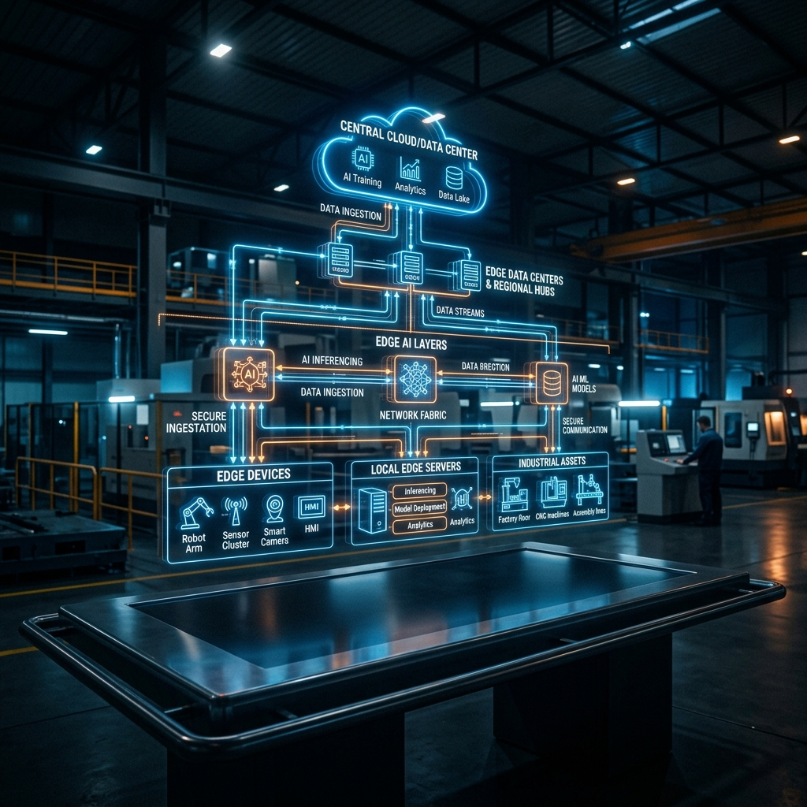
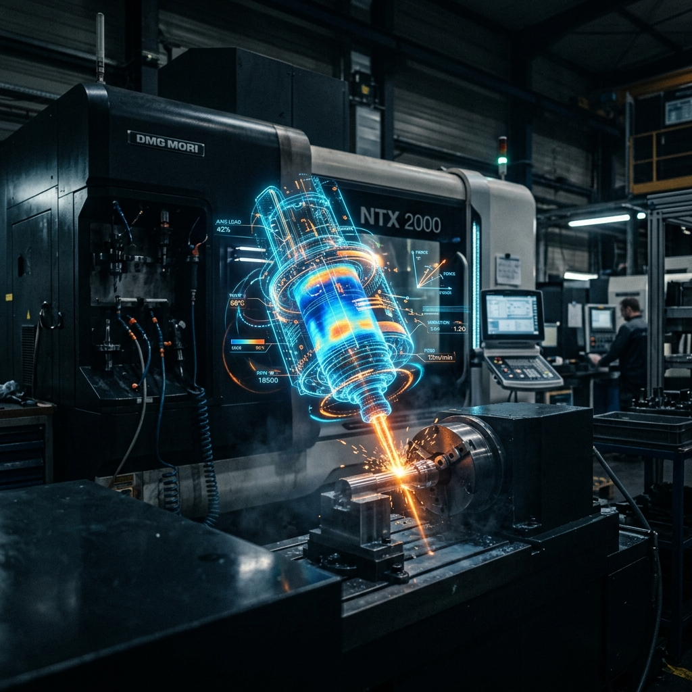
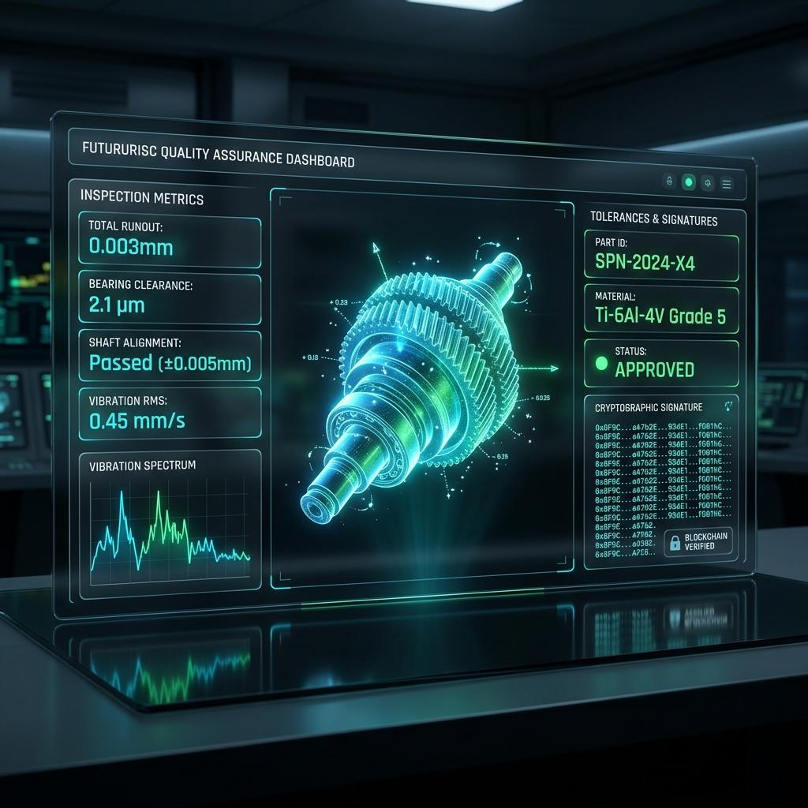
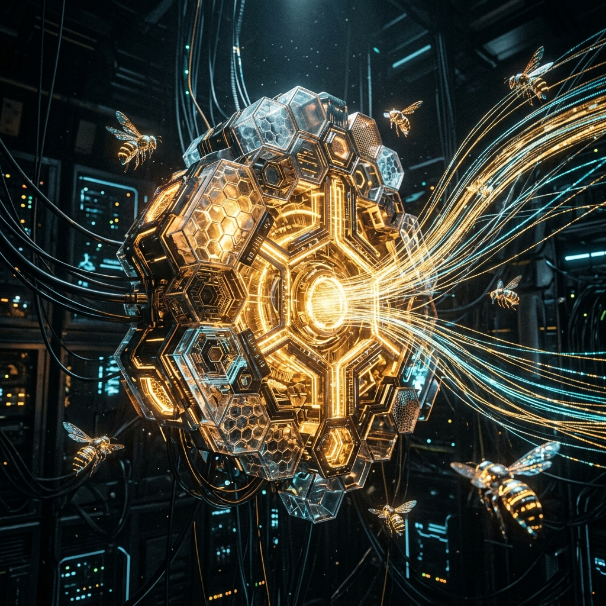
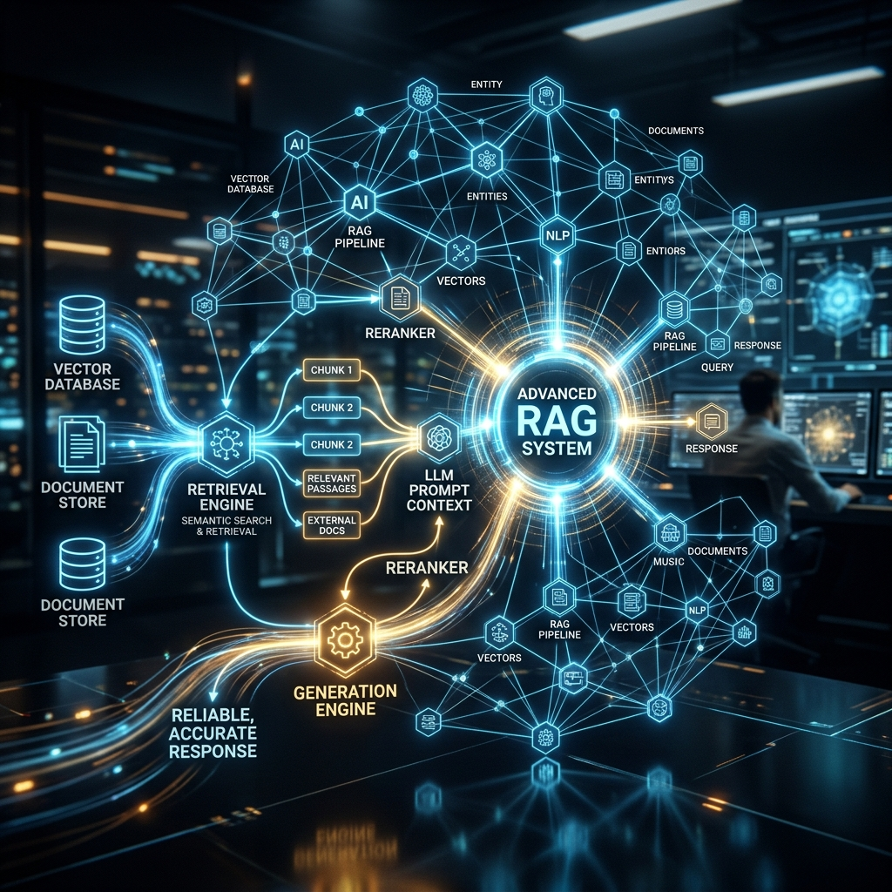
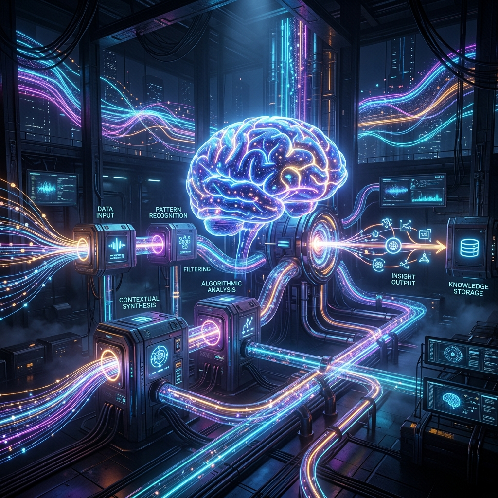
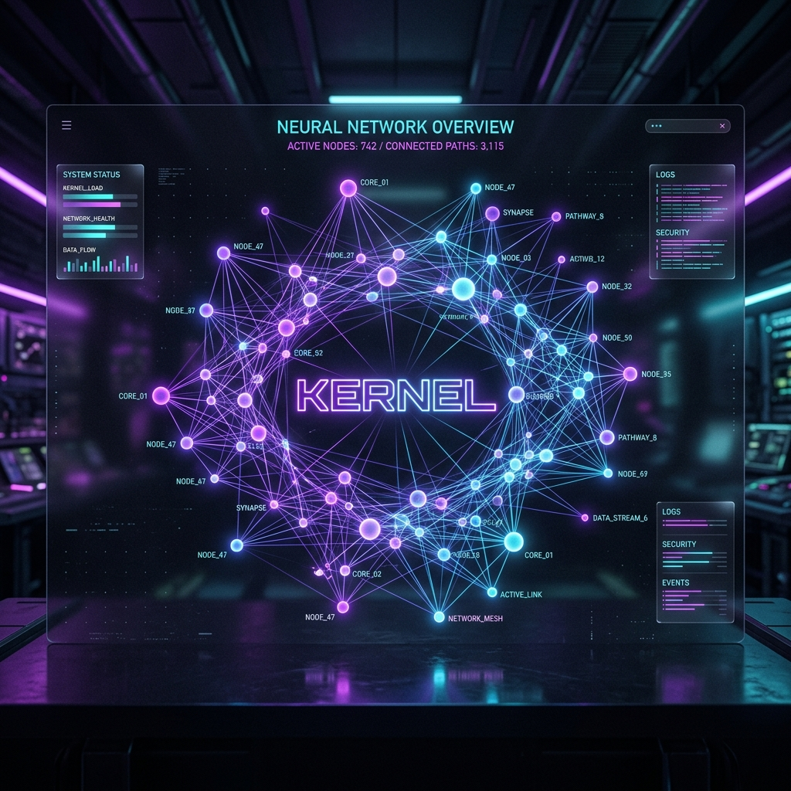
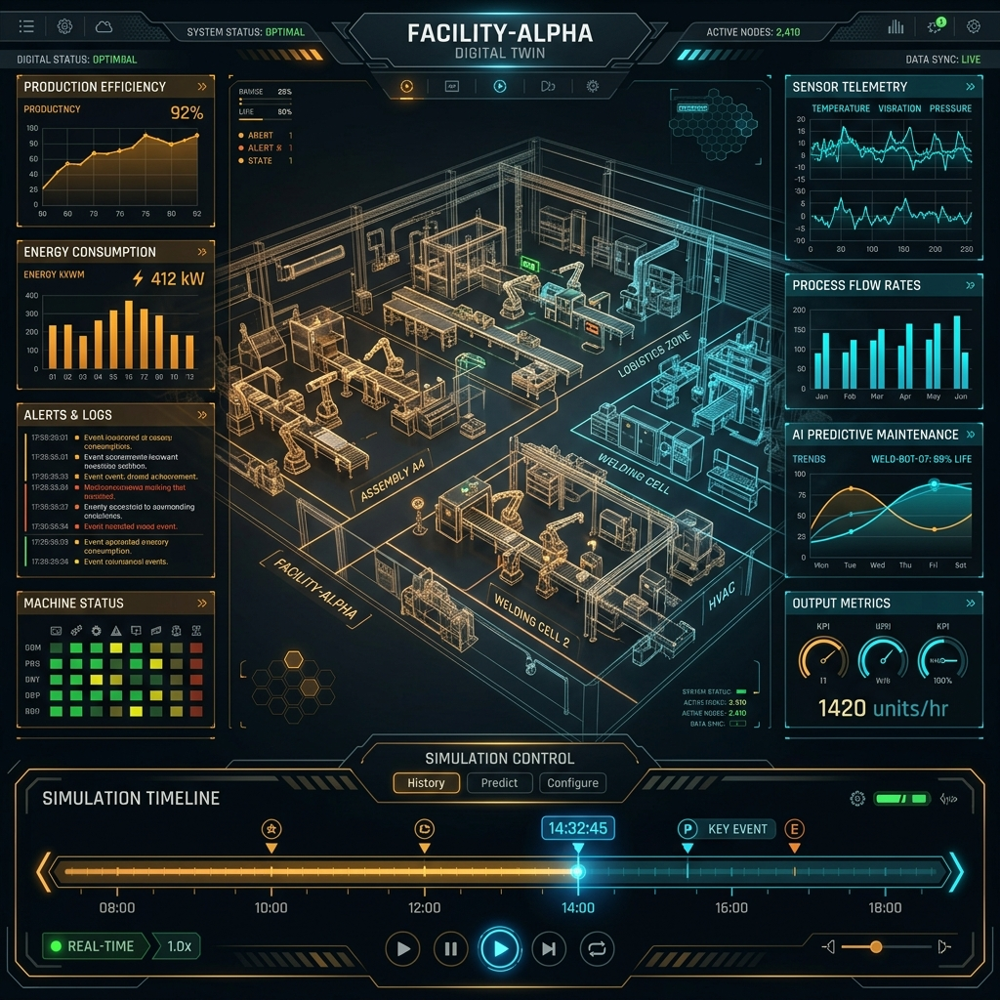
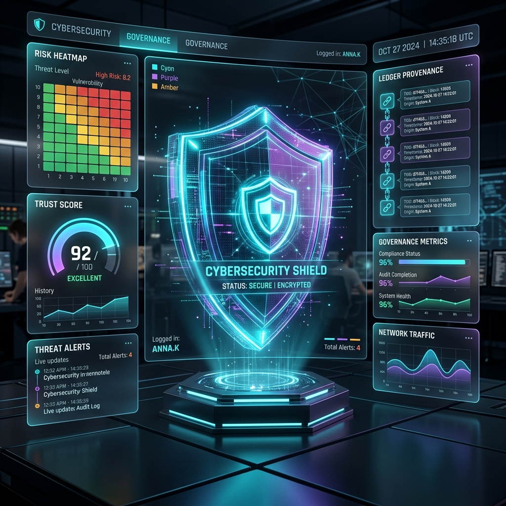

  

  # ZRT TwinRSI Autonomic Edge OS
  **Portfolio-Grade Cyber-Physical Digital Twins + Bounded Recursive Self-Improvement**

  
  
  

 

The **ZRT TwinRSI Autonomic Edge OS** is a cutting-edge industrial intelligence platform. It fuses **Cyber-Physical Digital Twins (CPDT)** with **Bounded Recursive Self-Improvement (RSI)** to autonomously orchestrate factory operations, govern edge-device security, and self-optimize through swarms of biomimetic AI agents.

---

## 1. The Core Factory Engine

Industrial robotics require absolute deterministic state and sub-millisecond precision. By linking physical factory assets to edge-deployed Digital Twins, ZRT establishes an unshakeable ground truth for all cognitive operations.

  
  

---

## 2. Agent Swarms & Biomimetic Intelligence

  

ZRT TwinRSI operates on a biomimetic architectural thesis:
* **Dolphin Pods (Cognitive Orchestration):** Small, highly intelligent collaborative pods handling complex planning and reasoning.
* **Bee Hives (Coordination & Execution):** Massively distributed worker swarms routing signals, executing waggle-dance heuristics, and mutating genomes.

---

## 3. RAG & Procedural Cognition

  

When anomalies arise, agents do not hallucinate—they rely on **Retrieval-Augmented Generation (RAG)**. Grounded by decades of historical telemetry, engineering specs, and compliance documents, the data pipeline dynamically injects context directly into the agent reasoning loops.

  

---

## 4. Immutable Blockchain Provenance

Every single telemetry spike, agent decision, and genome mutation is cryptographically hashed and persisted onto the TwinRSI Immutable Ledger. This ensures perfect auditability for defense contractors, industrial compliance boards, and QA inspections.

---

## 5. UI/UX: The Command Center

  

The entire Command Center is built using high-performance Next.js Server Components, extreme glassmorphism (`backdrop-blur-3xl`), Framer Motion physics, and WebGL particle shaders.

  
  

---

## 6. Bounded Governance & Security

Recursive Self-Improvement (RSI) is incredibly powerful, but requires rigid boundaries to prevent safety envelope violations. The **Governance Shield** module strictly enforces parameter bounding. Any AI-generated proposal must pass procedural gates, QA simulation, and human-in-the-loop authorization before deploying to the physical factory floor.

---

### Features At a Glance

* **1-Minute ISR Edge Caching:** `export const revalidate = 60` deployed globally, cutting database query load by 99%.
* **Ambient Audio Experience:** Features a fully integrated cinematic ambient soundtrack (toggle via bottom-right interface).
* **Massive Swarm Concurrency:** Biomimetic families executing simultaneous parallel telemetry evaluations.
* **Row-Level Security (RLS):** Supabase Multi-Tenant enforcement ensuring data isolation across enterprise zones.

---

  <i>Deployed via Vercel Edge Network. Powered by the Gemini Antigravity Framework.</i>

---

## Author's Final Note

Building cyber-physical digital twins combined with bounded recursive self-improvement demands an architecture that fundamentally respects the unpredictability of physical industrial systems. The concepts materialized in this repository are deeply informed by over 100 academic papers and industry specifications spanning deterministic control theory, multi-agent reinforcement learning, blockchain consensus provenance, and edge-native WebGL processing. 

By modeling systems after biomimetic patterns—dolphin pods for high-context cognitive tasks, and beehives for low-latency parallel orchestration—we establish a scalable, fault-tolerant intelligence grid. When paired with the uncompromising data integrity of on-chain ledgers and the continuous verification loop of Retrieval-Augmented Generation (RAG), the result is an Autonomic Edge OS capable of safely upgrading its own capabilities without breaking the physical safety envelope. 

This repository serves as both a proof-of-concept and a structural blueprint for the next decade of industrial AI.

---

## On-Chain Systems Portfolio

Core XRPL EVM systems plus related public product and AI repositories from the same portfolio.

<table>
  <thead>
    <tr>
      <th>Project</th>
      <th>Description</th>
      <th>Status</th>
    </tr>
  </thead>
  <tbody>
    <tr>
      <td><a href="https://github.com/zrt219/Zuc-Mine-Command-Center">ZUC Mine Command Center</a></td>
      <td>On-chain uranium mining operations dashboard with real-time reserve tracking, miner registry, and direct contract interaction through a frontend-only control surface.</td>
      <td><a href="https://zuc-mine-command-center.vercel.app/">Live</a></td>
    </tr>
    <tr>
      <td><a href="https://github.com/zrt219/-U235-Fuel-Cycle-">U235 Fuel Cycle</a></td>
      <td>Deterministic XRPL EVM fuel-cycle pipeline that tracks uranium batches from ore to enriched fuel rod with full on-chain traceability.</td>
      <td><a href="https://u235-fuel-cycle.vercel.app/">Live</a></td>
    </tr>
    <tr>
      <td><a href="https://github.com/zrt219/ISR-Network">ISR Network</a></td>
      <td>In-situ recovery control system with on-chain asset tracking, lifecycle state transitions, and operator-facing industrial simulation.</td>
      <td><a href="https://isr-network.vercel.app/">Live</a></td>
    </tr>
    <tr>
      <td><a href="https://github.com/zrt219/Dark-Matter-Farm">Dark Matter Farm</a></td>
      <td>XRPL EVM staking protocol with three orbit tiers, lock-period yield mechanics, and event-driven reward emissions.</td>
      <td><a href="https://dark-matter-farm.vercel.app/">Live</a></td>
    </tr>
    <tr>
      <td><a href="https://github.com/zrt219/Cohr-Lab">Cohr Lab</a></td>
      <td>Semiconductor laser fabrication lifecycle modeled as an immutable on-chain state machine from crystal growth to final pigtail.</td>
      <td><a href="https://cohr-lab.vercel.app">Live</a></td>
    </tr>
    <tr>
      <td><a href="https://github.com/zrt219/ForgeX">ForgeX</a></td>
      <td>Foundry-powered XRPL EVM deployment console that combines a natural-language UI, Node CLI orchestration, and realtime shader-based visuals.</td>
      <td><a href="https://forgex-theta.vercel.app">Live</a></td>
    </tr>
    <tr>
      <td><a href="https://github.com/zrt219/DatumX">DatumX</a></td>
      <td>Verification protocol for AI-transformed industrial data with deterministic lineage, validator review, and XRPL EVM finalization.</td>
      <td><a href="https://datumx.vercel.app">Live</a></td>
    </tr>
    <tr>
      <td><a href="https://github.com/zrt219/Ethex-Lottery-Game">Ethex Lottery Game</a></td>
      <td>Foundry plus Next.js betting workflow that modernizes the EthexLoto lifecycle for XRPL EVM reviewer-facing execution.</td>
      <td>Public Repo</td>
    </tr>
    <tr>
      <td><a href="https://github.com/zrt219/3DMoonX">3DMoonX</a></td>
      <td>Cinematic lunar industrial-base experience that combines Blender source assets with a React Three Fiber web runtime.</td>
      <td><a href="https://3dmoonx.vercel.app">Live</a></td>
    </tr>
    <tr>
      <td><a href="https://github.com/zrt219/Unknown002">Unknown002</a></td>
      <td>Browser-based 3D engineering viewer for a nuclear-electric propulsion spacecraft concept with staged prompt-pack support.</td>
      <td>Public Repo</td>
    </tr>
    <tr>
      <td><a href="https://github.com/zrt219/AI-Engineering-Evidence-Engine">AI Engineering Evidence Engine</a></td>
      <td>Interactive evidence dashboard that turns local engineering proof into a reviewer-facing systems narrative.</td>
      <td><a href="https://zhane-grey-evidence-dashboard.vercel.app/">Live</a></td>
    </tr>
    <tr>
      <td><a href="https://github.com/zrt219/Build-Doctor">Build Doctor</a></td>
      <td>Codex-style build diagnosis harness for failed Next.js and Vercel builds with deterministic failure analysis.</td>
      <td><a href="https://vercel-build-doctor-agent.vercel.app">Live</a></td>
    </tr>
    <tr>
      <td><a href="https://github.com/zrt219/ai-gateway-failover-playground">AI Gateway Failover Playground</a></td>
      <td>Public-facing sandbox for request routing, provider fallback, and resilient AI gateway behavior.</td>
      <td><a href="https://ai-gateway-failover-playground.vercel.app">Live</a></td>
    </tr>
    <tr>
      <td><a href="https://github.com/zrt219/enterprise-agent-workflow-studio">Enterprise Agent Workflow Studio</a></td>
      <td>Public-facing studio for approval-gated enterprise agent workflows, risk scoring, and audit-oriented design.</td>
      <td><a href="https://enterprise-agent-workflow-studio.vercel.app">Live</a></td>
    </tr>
    <tr>
      <td><a href="https://github.com/zrt219/resume-evidence-rag-auditor">Resume Evidence RAG Auditor</a></td>
      <td>Public-facing proof surface for claim verification, evidence retrieval, and grounded resume bullet generation.</td>
      <td><a href="https://resume-evidence-rag-auditor.vercel.app">Live</a></td>
    </tr>
    <tr>
      <td><a href="https://github.com/zrt219/AI-resume-tailor-service-">AI Resume Tailor Service</a></td>
      <td>Static Vercel-ready application for evidence-backed resume, cover-letter, and job-packet tailoring.</td>
      <td><a href="https://ai-resume-tailor-service.vercel.app">Live</a></td>
    </tr>
    <tr>
      <td><a href="https://github.com/zrt219/Fuji">Fuji</a></td>
      <td>Cinematic Next.js Fuji gallery atlas for portfolio storytelling and visual system design.</td>
      <td><a href="https://fuji-byzrt.vercel.app">Live</a></td>
    </tr>
    <tr>
      <td><a href="https://github.com/zrt219/ai-agents-for-beginners">AI Agents for Beginners</a></td>
      <td>Lesson repository for getting started building AI agents.</td>
      <td>Public Repo</td>
    </tr>
    <tr>
      <td><a href="https://github.com/zrt219/agentic-rag-memory-digital-twin-edge-system">Agentic RAG Memory Digital Twin Edge System</a></td>
      <td>Public-facing landing page for an agentic RAG, memory, and digital-twin edge-system portfolio project.</td>
      <td><a href="https://agentic-rag-memory-digital-twin-edg.vercel.app">Live</a></td>
    </tr>
  </tbody>
</table>
