# TN Precision AI - Cyber-Physical Operating Layer

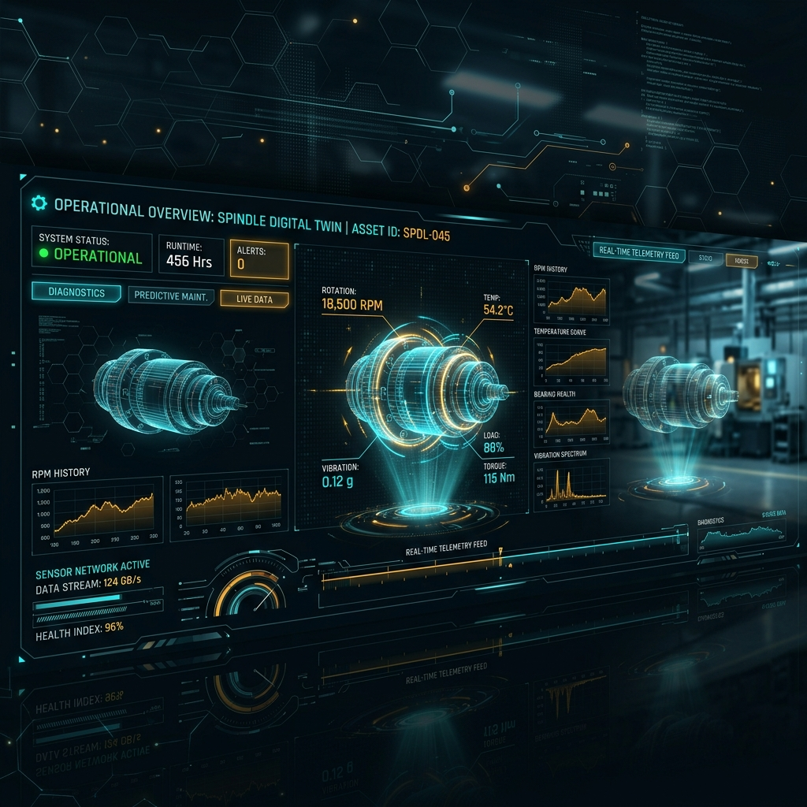


Welcome to **Nakashima-Tsubaki**, an advanced industrial AI command center and cyber-physical digital twin simulator.

This repository demonstrates the convergence of modern web frameworks and autonomous AI agents into a single "Sentient Operating System" designed for the manufacturing floor. It provides an interactive, operator-safe digital twin environment to simulate incidents, deploy AI swarms, and securely manage machine workflows.

---

## 🌟 Core Features

- **Cyber-Physical Digital Twin**: Live, interactive WebGL 3D modeling of factory floors and precision spindles. Manipulate the "T-MINUS Scrubber" to rewind global simulator time and replay historic incidents.
- **Autonomous Agent Swarm**: Press `CTRL+K` to open the integrated agent terminal. Spawn AI agents that physically fly across the DOM to hunt anomalies, lock onto telemetry, and provide context-aware help tips.
- **Holographic Glassmorphism UI**: An extreme, boundary-pushing futuristic UI. UI panels break out of 2D sidebars into massive 3D holograms using Framer Motion physics.
- **Native Web Audio Engine**: Completely synthesized UI sound effects (keystrokes, hover hums, alarm thrums) generated in-browser via the mathematical oscillators of the Web Audio API.
- **Advisory-First Workflow**: An explicit node-graph approval gate to ensure that AI-generated actions are safely reviewed and cryptographically signed by human operators before "shadow execution."

---

## 🛠️ Technology Stack

- **Framework**: [Next.js 14](https://nextjs.org/) (App Router)
- **Styling**: [Tailwind CSS](https://tailwindcss.com/) with heavy glassmorphism constraints
- **Animation Physics**: [Framer Motion](https://www.framer.com/motion/)
- **3D Rendering**: [Three.js](https://threejs.org/) & React Three Fiber (via dynamic imports)
- **State Management**: [Zustand](https://github.com/pmndrs/zustand)
- **Icons**: [Lucide React](https://lucide.dev/)

---

## 🚀 Getting Started

To run the deterministic lab simulator locally:

```bash
# 1. Clone the repository
git clone https://github.com/zrt219/nakashima-tsubaki.git

# 2. Navigate into the directory
cd nakashima-tsubaki

# 3. Install dependencies
npm install

# 4. Start the development server
npm run dev
```

Navigate to `http://localhost:3000` to interact with the command center.

---

## 📂 Project Structure

```text
├── app/                      # Next.js 14 App Router pages (11 custom routes)
├── components/
│   └── tn-command-center/    # The core cyber-physical UI components
├── lib/
│   ├── simulator/            # Zustand stores, Web Audio engine, & simulation logic
│   └── tn-ai-data.ts         # Hardcoded mock scenarios, KPIs, and evidence payloads
├── public/
│   └── docs/                 # Image gallery and visual mockups
└── README.md                 # You are here
```

---

## OpenAI Integration Blueprint

The current Nakashima-Tsubaki Command Center operates as a **Deterministic Lab Simulator**. This means incidents, RAG contexts, and agent swarms execute predictably via state machines to guarantee a safe, reviewable operator experience.

To transition from a "Simulation" to "Live Cognition", this blueprint outlines how we will seamlessly inject OpenAI models (specifically `gpt-4o` and `text-embedding-3-small`) into the architecture without compromising the critical **Advisory-First Governance** rails.

### 1. RAG Knowledge Console Migration
- **Vector Database**: Connect the application to a Pinecone or Supabase pgvector instance.
- **Embeddings Pipeline**: When an incident occurs (e.g., Thermal Variance), pass raw sensor data through `text-embedding-3-small`.
- **Retrieval & Synthesis**: Query the vector store for the top 5 most relevant SOPs. Use the Next.js AI SDK (`generateText`) calling `gpt-4o` to summarize the retrieved context into the "Evidence Packet".

### 2. Multi-Agent Swarm Logic
- **Agent Orchestration**: Utilize the OpenAI Assistants API to manage the swarm.
- **Dynamic Goals**: When you type `spawn anomaly-hunter 3` in the terminal, the command is sent to `gpt-4o` as a system prompt. The model decides which telemetry components require investigation.
- **Function Calling**: The agents use OpenAI Function Calling to physically trigger simulator events (e.g., `{"name": "trigger_thermal_alert"}`). The UI reacts to the model's function calls in real-time.

### 3. Advisory Automation Workflow
- **Dynamic Playbooks**: The AI generates the `/advisory` node graph dynamically. 
- **Human-in-the-Loop Constraint**: Even when using `gpt-4o` to generate the remediation plan, the architecture enforces that the action remains a *Draft Proposal*. The operator must cryptographically sign off before execution.

---

## The Dashboard Vision Gallery

A showcase of the cyber-physical routes built within this application.

### 1. Digital Twin Simulator


### 2. QA Evidence Report & 3D Holograms


### 3. Cognitive Agent Swarm Brain


### 4. Risk & Governance Compliance


### 5. Concept Model 1
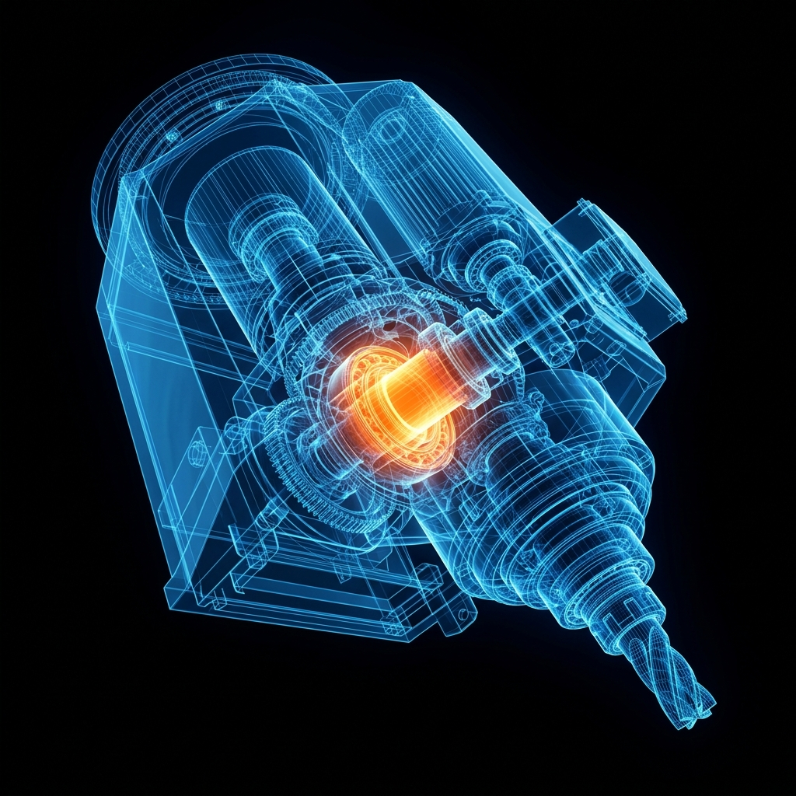

### 6. Media Render A
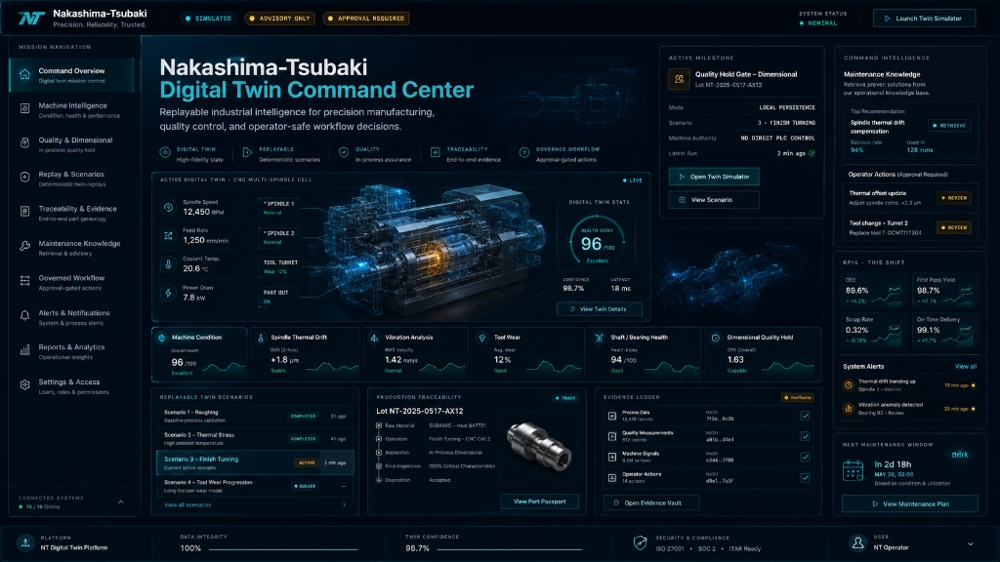

### 7. Media Render B
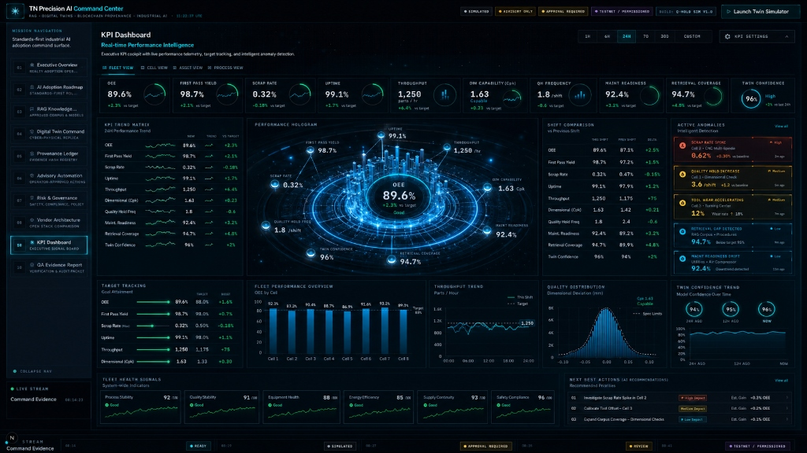

### 8. Media Render C
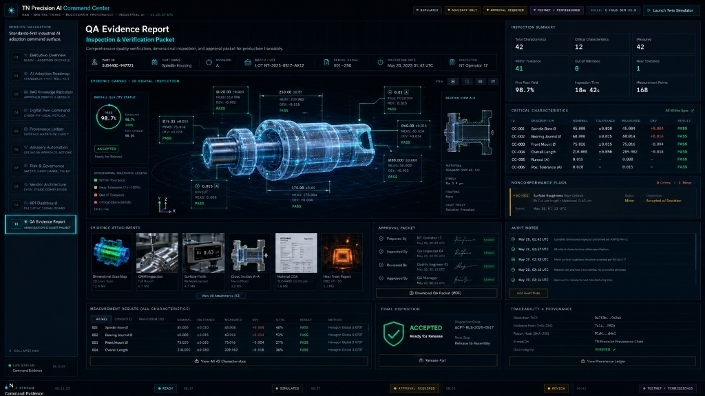

### 9. Media Render D
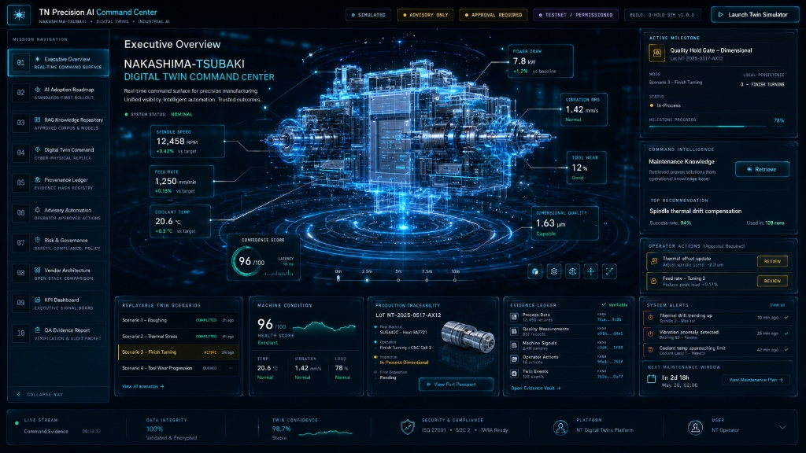

### 10. Media Render E
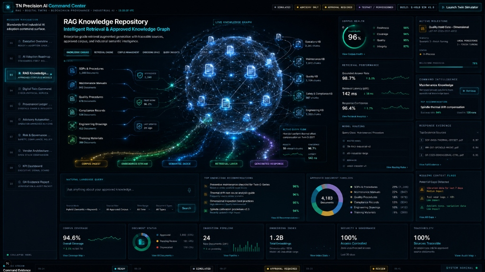

### 11. Media Render F
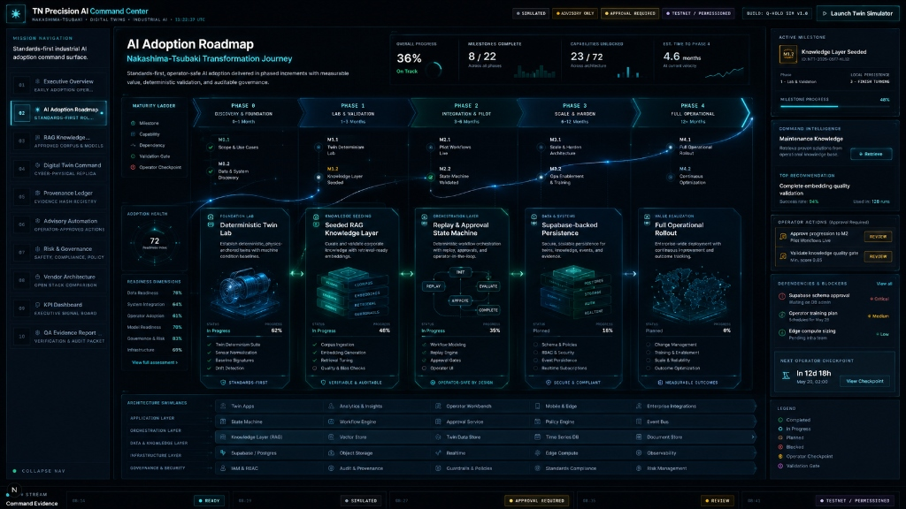

### 12. Media Render G
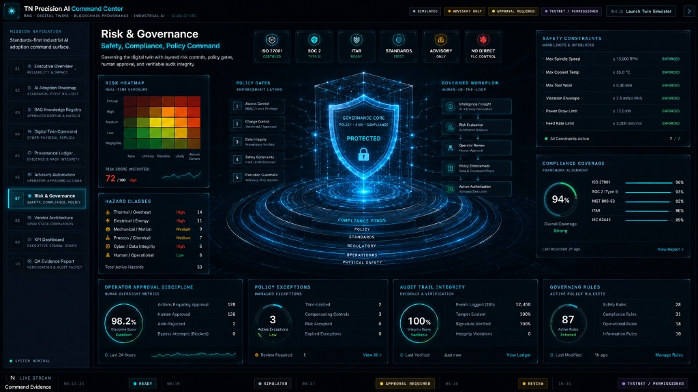

### 13. Media Render H
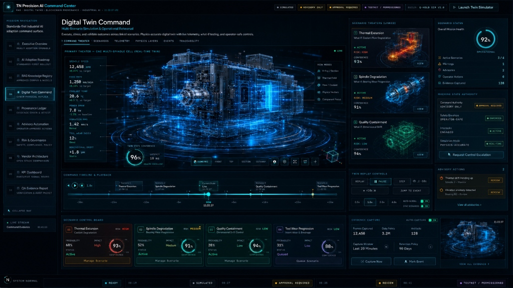

### 14. Media Render I
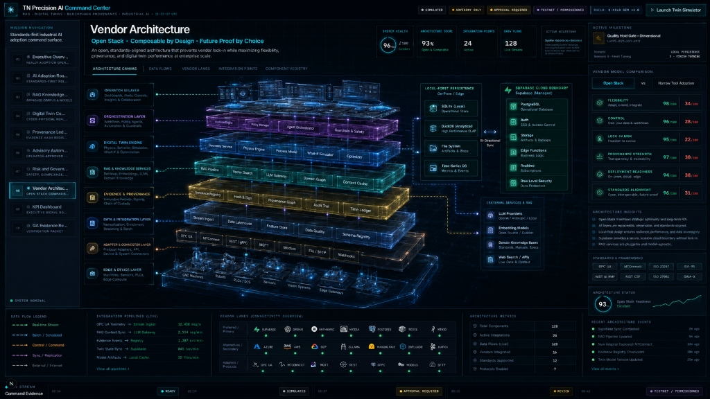

### 15. Concept Model Interface
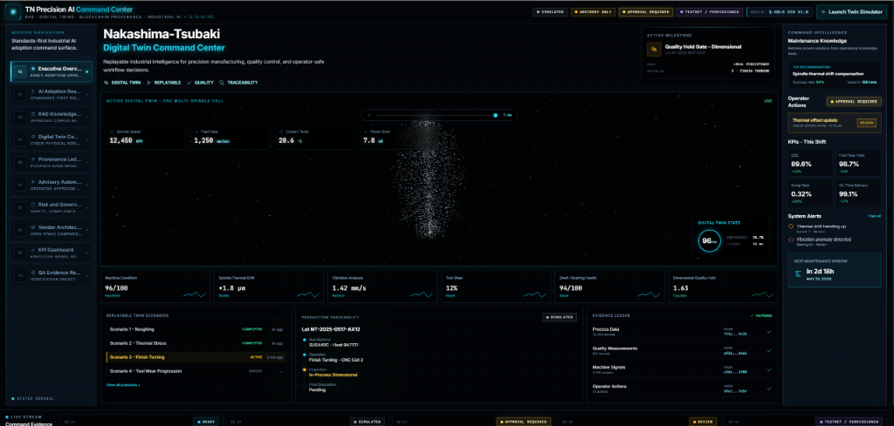

---
*Built as a next-generation industrial AI interface.*
